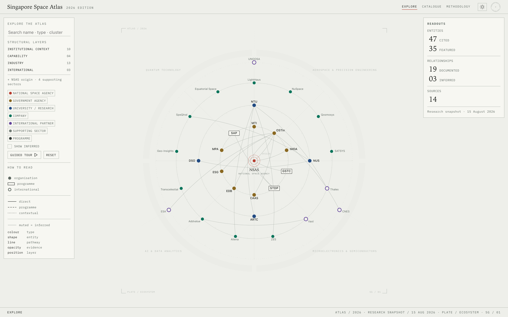
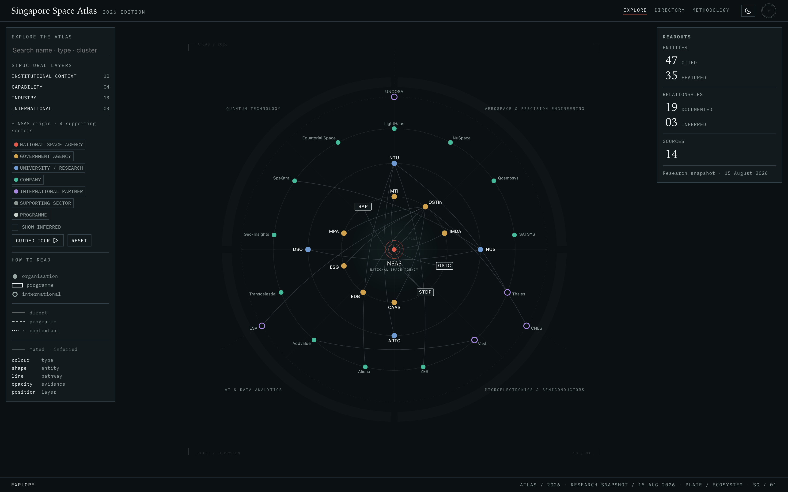
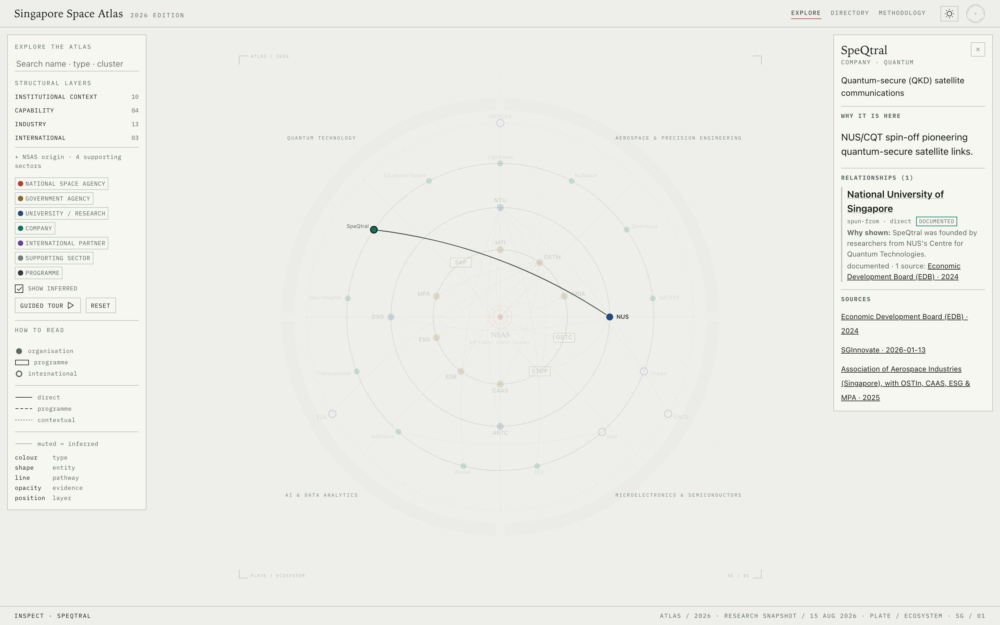
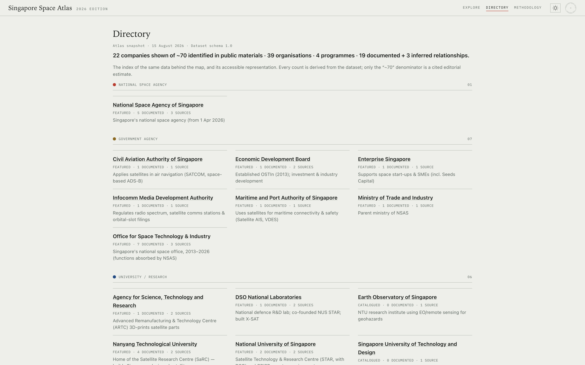

# Singapore Space Atlas

**A visual, evidence-backed systems map of Singapore's space ecosystem.**
_Government · Research · Industry · International_

[](https://radc4t.github.io/singapore-space-atlas/)
[](https://github.com/radc4t/singapore-space-atlas/actions/workflows/ci.yml)
[](#license)
[](#tech-stack)

> **Live:** <https://radc4t.github.io/singapore-space-atlas/> — 2026 Edition · research snapshot 17 Aug 2026



NSAS (the National Space Agency of Singapore, established 1 April 2026) has an ecosystem-building
mandate, but there is no single visual overview of how its parts connect. People cannot participate
in a system they cannot see. The Atlas makes the relationships between the agency, government bodies,
universities, ~70 companies, national programmes and international partners legible in one view — and
does so **honestly**, showing what is documented, what is inferred, and how each relationship is known.

> **Editorial thesis.** This maps the publicly documented relationships and structural roles
> connecting Singapore's space institutions, research community, companies, programmes and supporting
> ecosystem — _not_ an exhaustive representation of every company or every relationship.

## Table of contents

- [Overview](#overview)
- [The six-channel visual grammar](#the-six-channel-visual-grammar)
- [Usage](#usage)
- [Evidence & honesty model](#evidence--honesty-model)
- [Getting started](#getting-started)
- [Development](#development)
- [Project structure](#project-structure)
- [Tech stack](#tech-stack)
- [Accessibility](#accessibility)
- [Versioning & editions](#versioning--editions)
- [Roadmap](#roadmap)
- [Contributing](#contributing)
- [License](#license)

## Overview

A **"scientific / mission-control instrument"**: a large, centred constellation on a technical
canvas, in two matched themes — a light _archival instrument_ and a dark _night operations room_
(same instrument, two temperatures). It is a research-grade information system that happens to have a
visualization, not the reverse. Aesthetic hierarchy: **map → evidence → instrument chrome**. The
instrument metaphor is expressive, not literal — no fictional telemetry or spatial claims.



_The same instrument in two temperatures — a dark "night operations room" that follows your system theme._

**Highlights**

- **Evidence-first.** Every relationship carries its own sources and two independent labels.
- **Six-channel visual grammar** — meaning never rests on colour alone.
- **Three deep-linkable views** — Explore, Directory, Methodology — with shareable URL state.
- **Dual-theme** light/dark that follows system preference.
- **Accessible** — keyboard-operable, axe-clean in CI, with a fully semantic text representation.
- **Zero runtime dependencies** — a self-contained static site under a strict CSP.

## The six-channel visual grammar

Meaning never rests on colour alone:

| channel  | encodes                                                                                |
| -------- | -------------------------------------------------------------------------------------- |
| colour   | stakeholder **type** (on nodes; edges stay neutral)                                    |
| shape    | ontology — organisation circle · programme plaque · international outline · sector arc |
| stroke   | **pathway** — solid direct · dashed programme-mediated · dotted contextual             |
| opacity  | **confidence** — documented crisp · inferred muted (off by default)                    |
| position | structural **layer** — concentric ring, inner → outer                                  |
| size     | **editorial prominence** (declared, non-quantitative)                                  |

## Usage

Three views (real view switches; state is deep-linkable):

- **Explore** — the instrument. Click a node → focus mode; the right module switches from **Readouts**
  (derived counts) to an **Inspector** field-note with the relationship's evidence and cited sources.
  Search (name · type · cluster · alias), filter by type, toggle inferred links, or take the guided tour.
- **Directory** — the card-index of the full corpus (grouped by stakeholder type), and the accessible
  representation of the data. Entity names link to their official website (new tab) where the corpus
  provides one.
- **Methodology** — the intellectual contract: what the Atlas does, what it does not claim, what
  counts as evidence.



_Selecting a node locks focus and opens the Inspector — the relationship, why it is shown, and its cited sources._



_The Directory: the same corpus as an editorial, grouped card-index — and the accessible representation of the data._

Shareable deep links carry the exact state, for example:

| URL                         | Opens                                 |
| --------------------------- | ------------------------------------- |
| `?node=speqtral`            | Explore, focused on SpeQtral          |
| `?node=speqtral&inferred=1` | …with inferred relationships revealed |
| `?view=catalogue`           | The Directory (index of the corpus)   |
| `?q=quantum`                | Explore, pre-filtered to a search     |

Light/dark follow your system preference (toggle in the top bar). Desktop-first, with a mobile
companion (intelligent simplification, not forced parity).

## Evidence & honesty model

Every relationship carries its **own** sources and two independent labels — `confidence`
(documented vs inferred) and `pathway` (direct, programme-mediated, contextual). An edge exists only
when a specific source substantiates that specific relationship; **absence of an edge is not a claim
that no relationship exists.** Counts are derived from the data; only the "~70 companies" denominator
is a cited editorial estimate. The `research/` ledger records sources (with retrieval locations,
first-party vs secondary) and the editorial decisions behind the corpus.

## Getting started

**Prerequisites:** [Node.js](https://nodejs.org/) 22+ and npm.

```bash
git clone https://github.com/radc4t/singapore-space-atlas.git
cd singapore-space-atlas
npm install
npm run dev      # http://127.0.0.1:8000 (build-free static server)
```

Production build — a self-contained static site with no runtime dependencies:

```bash
npm run build && npm run preview
```

## Development

| Command                 | What it does                                                            |
| ----------------------- | ----------------------------------------------------------------------- |
| `npm run dev`           | Build-free static server at <http://127.0.0.1:8000>                     |
| `npm run build`         | Bundle + minify into `dist/` (self-contained)                           |
| `npm run preview`       | Build, then serve `dist/`                                               |
| `npm run validate`      | Data-contract integrity: ontology + evidence rules                      |
| `npm test`              | Unit tests (`node --test`) — the validator provably catches violations  |
| `npm run stress`        | Layout crossing/collision report                                        |
| `npm run check:links`   | URL liveness (manual; `-- --strict` fails on dead links)                |
| `npm run test:e2e`      | Playwright: interaction, deep links, axe a11y, visual regression        |
| `npm run release-check` | Full pre-release gate: the whole battery + a per-stage PASS/FAIL report |
| `npm run lint`          | ESLint                                                                  |
| `npm run format`        | Prettier (write) · `npm run format:check` to verify                     |

CI (GitHub Actions) runs lint, format, validate, build, and the unit tests on every push and pull
request; a separate workflow deploys `main` to GitHub Pages.

## Project structure

```text
js/
  data/{ecosystem,sources}.js   corpus + source registry (single source of truth)
  config.js                     controlled vocabularies + visual taxonomy
  layout.js  render.js          geometry → rich IR → declarative SVG
  interaction.js filters.js     focus/hover/keyboard · visibility/search/evidence
  readouts.js inspector.js      right panel: Readouts ↔ Inspector (one module, two modes)
  catalogue.js views.js         the Directory card-index · Explore/Directory/Methodology switching
  icons.js                      tiny inline-SVG icon set (Iconoir geometry, 1.5px stroke)
  router.js state.js            deep-link state ↔ shared store
  theme.js story.js app.js      theming · guided tour · bootstrap/controller
scripts/  validate-data.mjs · layout-stress.mjs · check-links.mjs · release-check.mjs · build.mjs · nocache_server.py
research/ evidence ledger (sources.md, decisions.md, entities.csv, relationships.csv, references.md)
test/     data.test.mjs · release.test.mjs · research-consistency.test.mjs (node --test) · e2e.spec.mjs (Playwright)
design.md  the design constitution
ROADMAP.md the forward plan (canonical; mirrored to GitHub milestones/issues)
```

## Tech stack

Vanilla ES modules. The visualization geometry is **hand-authored SVG path math** — no graph library,
no force simulation, no D3 or UI framework at runtime. Icons are a small inline-SVG set drawn on the
map's own stroke grammar. The app is bundled and minified with [esbuild](https://esbuild.github.io/)
into a **self-contained static site with zero runtime dependencies**, served under a strict
Content-Security-Policy (`connect-src 'none'`, no external hosts). Typography uses system font stacks.
Testing is `node --test` plus [Playwright](https://playwright.dev/) (interaction, accessibility via
[axe-core](https://github.com/dequelabs/axe-core), and visual regression).

## Accessibility

Accessibility is a first-class constraint, not an afterthought:

- SVG nodes are keyboard-focusable and operable (Enter / Space); a single neutral `:focus-visible`
  treatment is used throughout.
- Colour is never the only channel — type, shape, stroke and opacity all carry meaning.
- `prefers-reduced-motion` is respected; the Directory is a fully semantic, screen-reader-friendly
  representation of the same corpus.
- Every commit is checked against axe (WCAG 2.1 A/AA, no serious/critical violations) in CI.

## Versioning & editions

Two independent axes:

- **Software (SemVer):** git-tagged releases. `v1.0.0` was the first public release; **`v1.1.0`** (a data
  refresh within schema 1.0) is the current release. Patch = fixes; minor = new features or a data refresh
  within schema 1.0; major = a schema break or identity overhaul.
- **Editorial edition:** the content version, shown in-product — **2026 Edition · research snapshot
  17 Aug 2026 · dataset schema 1.0**. A future data refresh is a new Edition (and a minor bump).

## Roadmap

The forward plan lives in **[`ROADMAP.md`](ROADMAP.md)** — the canonical sequencing and scope document,
mirrored into GitHub [milestones](https://github.com/radc4t/singapore-space-atlas/milestones) and issues
(which carry execution detail and status). It is evidence-led: **`v1.1.0` — the current 2026 Edition —
grew evidence-backed coverage toward the ~70-company universe** (milestone #1, shipped); next is mobile /
guided-tour product depth (`v1.2.0`) and rolling engineering hardening. Deliberate non-goals — in-map
zoom/pan, faceted filtering, on-map cluster labels — are recorded there as non-goals, not backlog.

## Contributing

Issues and pull requests are welcome. Planned work is tracked in [`ROADMAP.md`](ROADMAP.md) and the
[open milestones](https://github.com/radc4t/singapore-space-atlas/milestones) — a good place to find scoped,
evidence-led tasks. Before opening a PR, please make sure the full gate is green:

```bash
npm run validate && npm test && npm run lint && npm run format:check && npm run build
```

New or changed data must satisfy the data contract (`npm run validate`) and carry its sources; visual
changes should be reviewed against the Playwright baselines before snapshots are regenerated. Keep the
architecture dependency-free and the existing visual language intact.

## License

Released under the [MIT License](LICENSE) — Copyright (c) 2026 radc4t.
